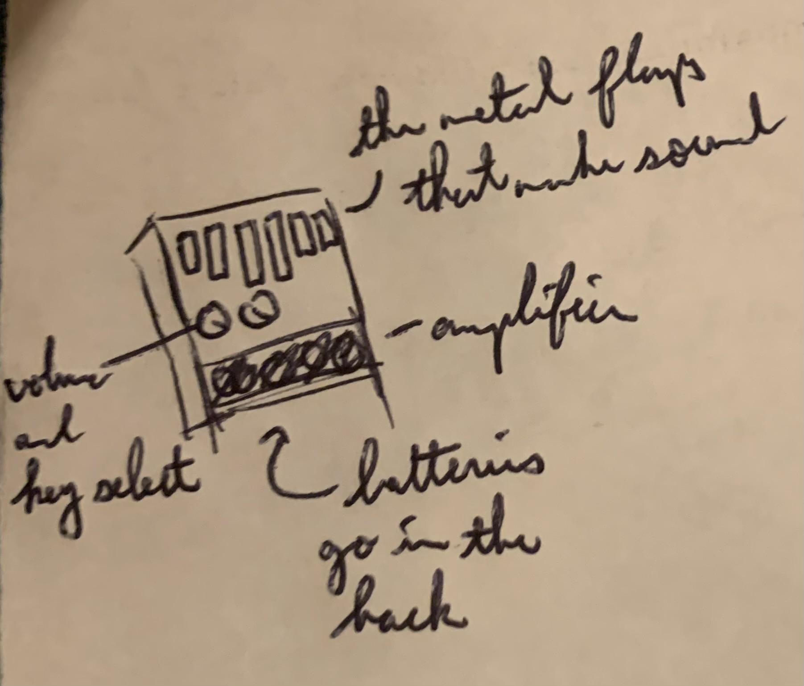

# E-Kali - The Electric Kalimba

## Team Members: ME

Me, the David (notdav) Z!

## Is this your first PCB

YES. I have no clue what I'm doing!

## What you are making? 

I will be making the E-Kali, an electric music instrument with a kalimba-like interface.
This instrument will allow us to entertain ourselves by creating beautiful music during downtime and rest periods.

## Inspiration:

1. Look at this cute little MIDI instrument! https://www.youtube.com/watch?v=Ivuy9QYLFVY

2. The humble kalimba https://www.youtube.com/watch?v=kd7KC3PaEaA

## Sketch

