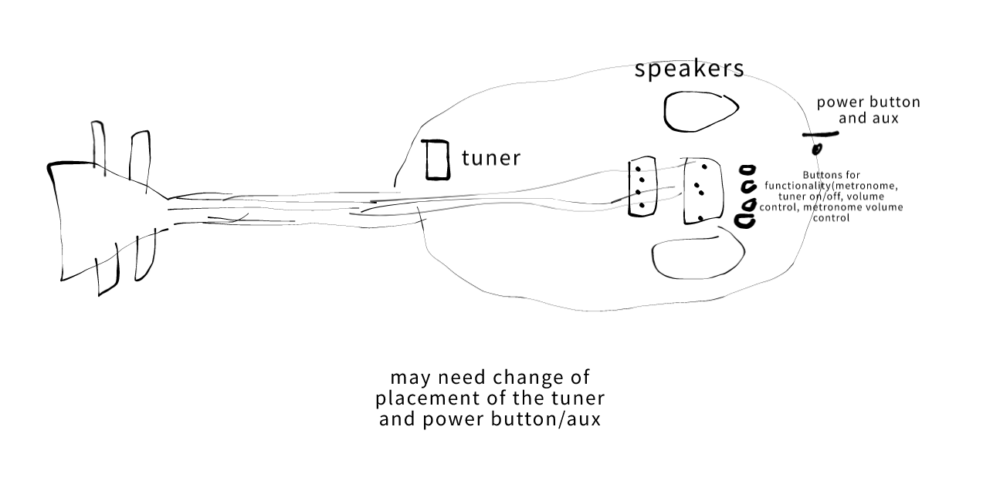

# MUSICA (Magestic Ukelele, Supplier of Immaculate Chords and Audio)

**Team Members (1-4 suggested):**

Ashlee Yin

Nathan Alspaugh

**Is this your first PCB rodeo? (if yes, don't feel bad. you're all good):** Yes, first time

**What you are making?**
A portable electric ukelele to play songs and sing by the campfire. Includes a built in tuner, speakers, metronome, volume control and pitch modulation. Charges with USB-C and includes an aux. (Bluetooth may be included...)

**Inspiration:** We both love music and wanted to share our passion with Hack Club!

**Sketches (if they exist) (paper works):**

