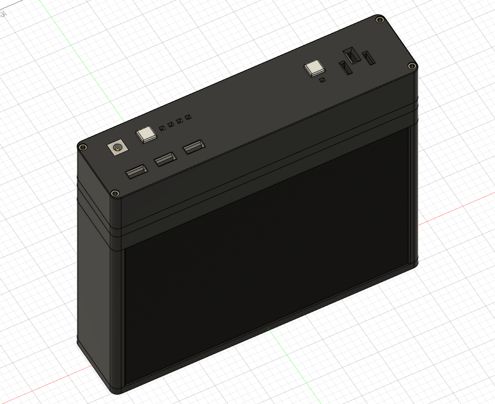
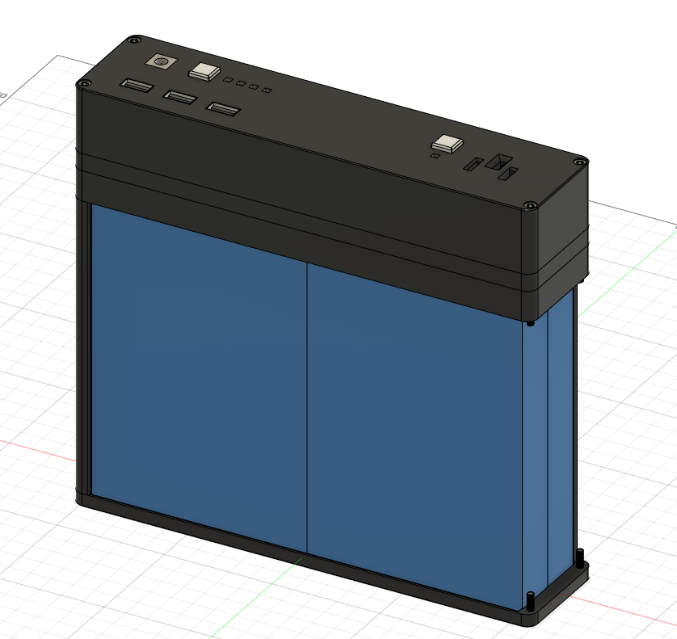
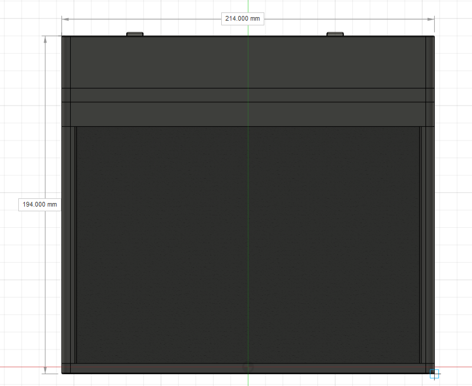

# Mobile Power Station

### Team Members (1-4 suggested)
4 - @pkb-pmj, @darth_taco_tmp, @Adimac93, @HubertK05 - from our school HackClub

### Is this your first PCB rodeo?
No. We mostly work with prototyping boards, but we've also designed a few PCBs and @darth-taco-tmp has hand-soldered *a lot* of prototyping boards and probably disassembled many PCBs, if that counts too lol

### What you are making?
A mobile power station.
- Big powerbank comparable in size to a thick book, storing a lot of energy while still being easy to carry in a backpack
- USB ports for fast-charging multiple devices (e.g. phones)
- DC jack with regulated voltage for more unusual or custom devices, e.g. a "pencil" soldering iron for in-situ repairs
- Our custom 200 V DC socket to power equipment such as camping LED lights
- 12,8 V • 30 Ah = 384 Wh of energy, more than enough for 7 days of phone charging for 3-5 people
- Tracks energy usage over time and displays in a mobile app

### Inspiration
Bigger power stations like Ecoflow, but in a form factor that can fit inside a backpack.

### Sketches (or a 3D model)

